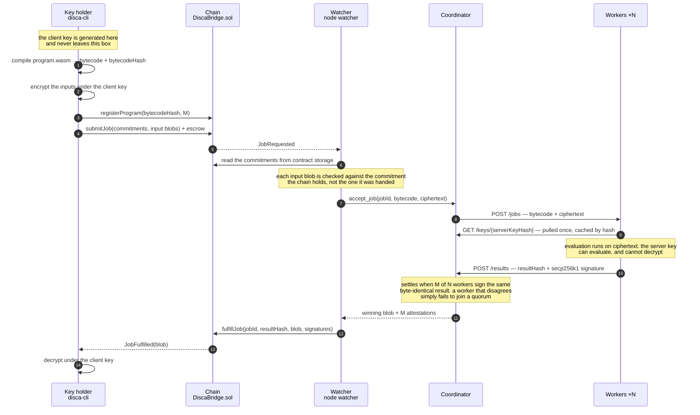

# disca

A distributed computer that executes programs under fully homomorphic
encryption: nodes evaluate circuits over ciphertexts they cannot decrypt, and
agreement between independent nodes is what makes a result trustworthy.

Agreement is counted over signed attestations: each worker signs a claim binding
the job, the program and the result it produced, so a third party can recover
who stood behind an answer rather than taking the coordinator's word for it
([bridge.md](docs/bridge.md) §2a).

New here? [getting-started.md](docs/getting-started.md) is the operator's path:
prerequisites, the one command, the same thing done by hand so you can see where
each key and each ciphertext goes, and
[running a program you wrote](docs/getting-started.md#running-your-own-program)
— what a circuit is allowed to contain, and the four commands from `.rs` to a
decrypted answer. Running it on more than one machine is
where byte-reproducibility stops being free; what has to match is in
[architecture.md](docs/architecture.md) §3, and the experiment that would settle
the one open question is in [tasks.md](docs/tasks.md) 5.3.

Design docs: [architecture.md](docs/architecture.md) (constraints, trust model)
· [bridge.md](docs/bridge.md) (Ethereum boundary)
· [attestation.md](docs/attestation.md) (why M-of-N, and what it costs)
· [tasks.md](docs/tasks.md) (what is built and what is next)
· [tfhe-determinism-request.md](docs/tfhe-determinism-request.md) (why evaluation
must be pinned to be reproducible)
· [`spec/`](spec/) (a TLA+ model of the attestation protocol, and what it proves)

Design decisions carry a pointer to the pull request that produced them, so the
reasoning and the dead ends stay recoverable rather than only the conclusion.

## How data moves

One job, end to end. The thing to follow is which box ever holds a key that can
decrypt: exactly one, and it is never on the network.



Three properties are visible in the arrows rather than asserted beside them.

**The client key appears twice and never moves.** It encrypts at step 2 and
decrypts at step 14, both inside the key holder. The key that travels to the
workers at step 9 is the *server* key: it can evaluate a circuit over ciphertext
and cannot open it, which is why serving it to anyone who asks for it by hash
costs nothing.

**Nobody is trusted to report their own work.** A result is accepted at step 11
because M workers independently produced the *same bytes* and each signed a
claim binding the job, the program and the result. A worker that diverges —
lying, or merely misconfigured — fails to join a quorum, and the job expires
into a refund rather than settling wrongly.

**The watcher re-derives what it verifies.** At step 6 it checks each input blob
against the commitment in contract storage rather than against the dispatch it
was handed, so an endpoint that fabricates a log has to fabricate the job it
names too.

Without a chain — which is what `run-local.sh` and `run-pong.sh disca` do —
steps 3 to 7 collapse into the key holder's own `POST /jobs`, and steps 11 to 13
into `GET /result/<jobId>`. Everything between the coordinator and the workers is
identical, which is the point: the chain decides who gets paid, not what the
answer is.

## Running it

Three worker processes evaluate an encrypted committee tally; the coordinator
settles on the result two of them independently attest to. The third worker is
deliberately faulty — a run where everyone agrees demonstrates nothing.

```sh
./scripts/run-local.sh              # 2-of-3, one faulty worker
HONEST=1 ./scripts/run-local.sh     # all three honest
ATTESTERS=3 ./scripts/run-local.sh  # unanimity required; fails, by design
```

The scores `71,93,42,88` are encrypted before they leave the key holder. No
worker sees a plaintext, and the winning score comes back correct.

Each worker signs its result with a secp256k1 key and the coordinator counts
agreement over the *recovered* Ethereum addresses, accepting only ones in the
registry it was started with ([bridge.md](docs/bridge.md) §2a). The local run
gives each worker a key derived from its `--id`, which is public by
construction and exists so the script needs no key distribution; a deployment
passes `--key`. `node worker-address --id <id>` prints the address a worker will
attest under.

The same thing against a real chain — Anvil, the contracts, escrow, and a
`fulfillJob` that counts the workers' own signatures — needs `anvil`, `cast` and
`forge` on the path:

```sh
./scripts/run-anvil.sh              # the script drives the lifecycle with cast
./scripts/run-anvil.sh --watcher    # `node watcher` settles it; no cast send
./scripts/run-anvil.sh --synthetic  # contracts and chain only, no Rust, no FHE
```

`--watcher` is the one that shows DISCA settling by itself: `node watcher`
subscribes to `JobRequested`, checks each input blob against the commitment the
contract is holding, runs the job, and submits the settlement. The script sends
no `fulfillJob` in that mode and proves it — it records every transaction hash it
produces and asserts the settling transaction is not one of them
([bridge.md](docs/bridge.md) §4, §8 step 3).

Single process, no network — the quickest way to tell whether a failure is in
the execution core or the transport. **Debug builds only**: it doubles as the
key holder, encrypting and decrypting in the same process, which is exactly the
separation a deployment has to keep.

```sh
cargo run -p node -- demo
RUST_LOG=debug cargo run -p node -- demo   # per-circuit spans
RUST_LOG=trace cargo run -p node -- demo   # per-opcode timings
```

Inspect what a WASM module lowers to, or re-measure the FHE constants the design
rests on:

```sh
cargo run -p primitives --example inspect -- committee-tally/committee_tally.wasm
cargo run --release -p primitives --example size_probe
```

Tests: `cargo test --workspace`. Note that
`primitives/tests/determinism_under_concurrency.rs` spawns child processes — it
guards byte-reproducibility of evaluation, which M-of-N depends on and which an
in-process test cannot check (see [architecture.md](docs/architecture.md) §3).

## Build shapes

A default release build has no `demo` role and no `--faulty` flag — neither
belongs in a production binary:

```sh
cargo build --release -p node                              # what you would ship
cargo build --release -p node --features fault-injection   # adds --faulty
cargo build -p node                                        # debug; adds `demo`
```

`scripts/run-local.sh` opts into `fault-injection` explicitly, because
demonstrating M-of-N requires a worker that disagrees.

`node/src/main.rs` lists the assumptions the binary makes but does not enforce —
worth reading before trusting a result, since a violation shows up as workers
disagreeing rather than as anything failing loudly.

## Checks

CI runs the first five on every push, and so can you — same commands, same
flags, so a green laptop and a red pipeline cannot disagree about why. The last
runs locally on `pre-push`, and in CI only on `main`; see [Coverage](#coverage):

```sh
cargo fmt --all --check
cargo clippy --workspace --all-targets --all-features --locked -- -D warnings
cargo test --workspace --all-features --locked
cargo check --workspace --all-targets --locked   # ...and default features still build
cargo test -p node --locked                      # ...and behave (no --faulty flag)
scripts/check-deps.sh          # lockfile in sync; tfhe still pinned exactly
scripts/coverage.sh --check    # per-crate coverage floors; pre-push, and main
```

`--all-features` is not decoration. A module behind an off-by-default feature is
not compiled by an ordinary build, so nothing type-checks it and nothing runs
its tests — it rots quietly while the coverage number stays flattering
([tasks.md](docs/tasks.md) 2.11b).

Neither is the pass *without* it. `--all-features` cannot see a missing feature
gate, because under it everything is enabled; a default build is what a release
actually compiles, and it is the one that has to prove there is no way to ask a
worker for a wrong answer.

`--locked` is the other half of the `tfhe` pin. The exact version in the
workspace manifest is what makes evaluation byte-reproducible
([architecture.md](docs/architecture.md) §3); building against a lockfile cargo
was allowed to rewrite would defeat it.

### Coverage

`scripts/coverage.sh` wraps [`cargo-llvm-cov`][llvm-cov] and writes
`target/llvm-cov/html/index.html`.

The floor is per crate, not one number for the workspace, and each floor carries
its reason in `scripts/lib/coverage_report.py`. `primitives` is the execution
core — pure functions with a checkable answer, and the thing an attestation is a
claim about — so it is held high. Much of `node` is socket binding, thread
spawning and blocking receive loops that only `scripts/run-local.sh` exercises;
tests written to walk those lines would raise the number and assert nothing.
`scripts/coverage.sh --check` applies the floors, and runs in two places:
on **`pre-push`** locally, and in CI on **`main` only**.

Not on PR pushes, because `cargo-llvm-cov` builds into a different target
directory with `RUSTC_WRAPPER` set and so shares nothing with the test job —
it pays for the whole dependency graph a second time, roughly doubling what a
push costs, to produce numbers you saw locally a minute earlier. But on `main`,
because the local hook is skippable with `--no-verify` and the merge commit is
the last place to catch a floor that a laptop quietly failed to enforce.

`--open` instead of `--check` writes and opens the browsable HTML report.

[llvm-cov]: https://github.com/taiki-e/cargo-llvm-cov

### Pre-commit hook

Formatting, linting and dependency hygiene on **commit**; coverage floors on
**push**, because that check measures the whole workspace and takes about a
minute — a per-commit cost that size is one people turn off, and a disabled
hook enforces nothing. Install [`pre-commit`](https://pre-commit.com/) (`brew
install pre-commit` on macOS), then:

```sh
pre-commit install   # installs both the pre-commit and pre-push hooks
```

Both, because `default_install_hook_types` asks for both — a plain
`pre-commit install` without it would leave the coverage gate uninstalled and
silent.

The hook deliberately does **not** run `cargo update`. Rewriting `Cargo.lock` on
every commit is exactly how the exact `tfhe` pin gets lost, and losing it breaks
byte-reproducible evaluation with no error — honest workers simply stop
agreeing. `scripts/check-deps.sh` verifies the pin instead of moving it; run it
with `--report` to see what an update *would* change, without changing anything.

## Status

The execution core, the distributed layer and the Ethereum bridge all work. A
job posted on-chain is picked up by `node watcher`, evaluated under FHE by three
workers that never see a plaintext, settled by a contract that recovers each
signer for itself, and decrypted by the key holder from the ciphertext the chain
carries. `./scripts/run-anvil.sh --watcher` is that, end to end, in about a
minute.

What is honest to say about the guarantee, rather than about the plumbing:

- **The key holder is a single party.** Inputs from mutually distrusting parties
  need multi-key or threshold FHE, which is not built and is not close
  ([architecture.md](docs/architecture.md) §2).
- **L0 admits no permissionless worker set.** Agreement is byte equality over
  identical evaluation, which is definitionally a closed, homogeneous fleet —
  one architecture, one tfhe version, one parameter set, the FFT plan pinned. A
  permissionless set needs the challenge window on the roadmap, not more of
  this ([attestation.md](docs/attestation.md), `paper/` §3.4).
- **`reveal` is trusted.** The chain can check that a result was attested; it
  cannot check that the plaintext a committee publishes is what the ciphertext
  contained. That needs verifiable decryption or a threshold KMS.

### The checklist

**74 done, 17 open.** [tasks.md](docs/tasks.md) carries each item with the
reasoning that closed it, including the ones that were closed by deciding *not*
to do them. This is the shape of it.

| Track | Done | Open |
|---|---:|---:|
| 0 · Groundwork | 4 | 1 |
| 1 · Execution core (`primitives/`) | 6 | 1 |
| 1b · Observability | 3 | — |
| 2 · Node roles and transport (`node/`) | 43 | 6 |
| 2c · Formal specification (`spec/`) | 3 | 2 |
| 2d · Coordinator as a job service | 3 | 1 |
| 3 · Ethereum bridge (`bridge/`) | **5** | **—** |
| 4 · Demo | 5 | 2 |
| 5 · Running it off this laptop | 2 | 1 |
| Stretch | — | 3 |

Done, in the sense that a script exercises it end to end: the opcode set and its
evaluator, bytecode with validation on receipt, M-of-N attestation over signed
claims, server-key distribution by hash, the coordinator as an HTTP job service,
the contract suite with the job state machine and the attester check, the chain
watcher that settles a job with no human in the loop, a TLA+ model whose
counterexample configurations are themselves checked, and two demos — an
encrypted committee tally and a six-circuit rally.

The seventeen open items are four different kinds of thing, and only one of them
is a hazard.

- **Needs a second machine — 2.10j, 5.3, and cheaply 2.10e.** Pinning the FFT
  plan pins the *algorithm*, not the SIMD width: `tfhe_fft` probes for AVX-512
  and falls back to AVX2, different lane counts reassociate the butterflies, and
  floating-point addition is not associative. So two *x86* workers can disagree,
  which makes `architecture.md` §3's "same architecture" insufficient. Untested,
  and untestable on one host. 5.3 specifies the experiment and names the harness
  that already exists for it. Until it runs, this is live.
- **Unbuilt code — 2.10b, 2.10f, 2.10g, 2c.4.** Enforcing the reproducibility
  preconditions at registration (which is waiting on the line above to know what
  to enforce), keeping a disputed job a first-class outcome, fault modes for the
  divergence we have actually seen — misconfiguration, not malice — and binding
  the input commitments into the signed digest, where the current soundness is
  incidental rather than stated.
- **Decisions, not tasks — 0.5, 4.5, 4.7.** Two open questions to confirm and
  strike, the demo video, and whether to adopt `experiment/pong-deflection`,
  which is a better rally and moves the bytecode hash every recorded measurement
  is pinned to.
- **Recorded limits rather than queued work — 1.2b, 2c.5, 2d.4, and Stretch.**
  The TLA+ model is single-job and unverified against the Rust by anything
  stronger than a hash tripwire. That is written down so it cannot be mistaken
  for a proof of more than it proves.

One upstream item sits outside all four: 2.10d, an issue to file against
`tfhe-rs` about `setup_custom_fft_plan` being public, `doc(hidden)`, absent from
the release notes, and panicking if called late. The draft is in
[tfhe-determinism-request.md](docs/tfhe-determinism-request.md).

## Research paper

The description of the Disca protocol and its design rationale, in `paper/`.
Built with XeLaTeX.

The paper describes the protocol. It is not the formal specification — that is
[`spec/`](spec/), a TLA+ model of M-of-N attestation and settlement checked by
TLC across 30 configurations in about 45 seconds, guarding `QuorumIsReal`,
`EscrowPaidOnce`, `NoSettleOnSplit`, `VoteNotDisplaced`,
`SomeoneActuallyEvaluated` and liveness.

Half those configurations are **supposed to fail**. Each removes one decision
the implementation makes and asserts that TLC then finds the specific
counterexample that decision exists to prevent, so `spec/check.sh` fails both
when a run reports an unexpected error *and* when one stops reporting its
expected one. That distinction is the whole point: a suite that only checks for
"no errors" cannot tell a proof from a model that has quietly stopped modelling
anything.

It found two real bugs, both since fixed. A minority quorum could settle during
the straggler grace period before honest workers had reported, which is why
`2M > N` is now enforced at startup. And a constant job id made attestations
interchangeable between runs, so a replay could *pre-empt* every honest worker
rather than merely displace one — first-write-wins is no defence against
arriving first. Job ids are per-run because of it.

It is pinned to the code it models. `spec/models.toml` hashes each modelled
function and `make -C spec drift` fails when one changes, naming what the spec
used it for. CI runs that before TLC, because it catches the failure TLC
structurally cannot: a model that is internally consistent and externally wrong.

What it does **not** cover is written down rather than left to be assumed. The
model is single-job with N ≤ 4, and the correspondence to the Rust is a careful
reading plus that hash tripwire — there is no extraction and no refinement
proof. Concurrent jobs, multiple chain ids, registration and gas are not
modelled at all (tasks 2c.5 and 2d.4).

### Setup

#### Pre-commit

The same hook as [above](#pre-commit-hook) — it spell-checks the document as
well as the Rust.

#### XeLaTex

Install XeLaTex, available via brew on macOS:

```sh
brew install basictex
```

### Build

```sh
make -C paper
```

### Clean

```sh
make -C paper clean
```

## License

[MIT](LICENSE).